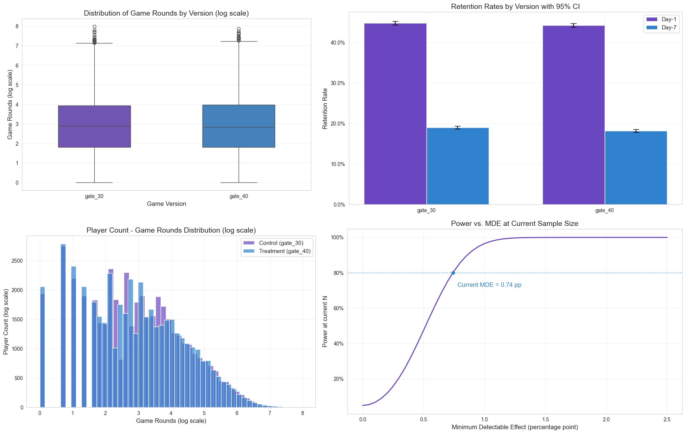
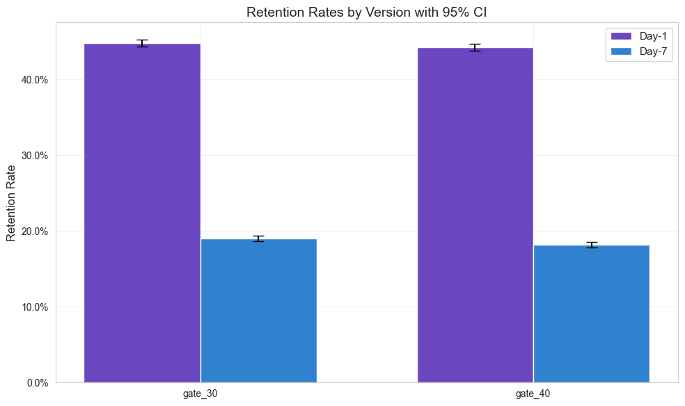

# Cookie Cats A/B Test Analysis

Impact of moving a mobile game progression gate on retention & engagement



## Executive Summary

**Business question:** Does moving the gate from level 30 → 40 affect player retention and engagement?

**Primary metric:** Day‑7 retention (``retention_7``).

**Guardrail metrics:** Day-1 retention (``retention_1``) and engagement (``sum_gamerounds``).

**Result:** Moving gate to level 40 **reduces day-7 retention by ~0.8 pp** (p < 0.05), which is negative and below the pre‑specified 1.0 pp MDE. Tests on guardrails indicate an insignificant difference.

**Decision:** _Do not roll out._ While the result is statistically significant, the effect is negative and below the practical threshold.

[See the report](reports/report.pdf)

## Dataset

| column | data type | description | 
|--------|-----------|-------------|
| `userid` | `int` | Unique player ID |
| `version` | `str` | Experiment split (``gate_30`` = control, ``gate_40`` = treatment) |
| `sum_gamerounds` | `int` | Total rounds per player |
| `retention_1` | `bool` | Active 1 day after installing the game |
| `retention_7` | `bool` | Active 7 days after installing the game |

Contains approximately 90k players (each row corresponding to 1 player), balanced across experiment groups.

[Link to data source](https://www.kaggle.com/datasets/mursideyarkin/mobile-games-ab-testing-cookie-cats)

## Experiment Design

**Population:** ``gate_30`` and ``gate_40`` players, with a balanced split of approximately 45k records (checked by SRM test).

**Primary metric:**
- Day-7 retention (``retention_7``): Two‑proportion z‑test  
Retention at day 7 is considered as a significant indicator of LTV in the industry.

**Guardrail metrics:**
- Day-1 retention (``retention_1``): Two-proportion z‑test
- Engagement (``sum_gamerounds``): Mann–Whitney U test and Welch's t-test on log-transformed data

**Power / MDE:** 80% power target, 1.0 pp MDE. Observed sample size achieves 0.74 pp MDE, a smaller detectable effect than the designed 1.0 pp MDE at 80% power.

**Significance level:** Pre-specified as 5% (alpha = 0.05) with 95% CI

**Multiple testing correction:** Guardrails adjusted via Holm method

**Decision rule:** Rollout only if the result is statistically significant, the experiment effect is larger than 1.0 pp, and guardrails do not display any negative effect.

## Key Results

| Metric          | Test             | Control | Treatment | Abs Δ (pp/unit)   | p-value |
| --------------- | ---------------- | ------- | --------- | ----------------- | ------- |
| Day-7 retention | Two-proportion z | 19.02%  | 18.20%    | -0.82 pp (-4.31%) | 0.0016  |
| Day-1 retention | Two-proportion z | 44.81%  | 44.22%    | -0.59 pp          | 0.15    |
| Game rounds     | Mann–Whitney U   | 52.46   | 51.30     | -1.16             | 0.15    |
|                 | Welch's t (log)  | 2.888   | 2.870     | -                 | 0.15    |

**Note:** 
- Guardrail p-values are Holm-adjusted.
- Cohen’s h = 0.02 for the primary metric, which is negligible in standardized magnitude (below the conventional threshold of 0.20 for a small effect).

**Interpretation:**
The difference in primary metric (``retention_7``) is statistically significant (p=0.0016). The treatment group (``gate_40``) shows a −0.82 pp decrease in day-7 retention compared to control (``gate_30``) with 95% CI [-1.33, -0.31] pp, corresponding to a -4.3% relative drop.
While the result is statistically significant, the effect is negative and below the practical threshold of 1.0 pp. Cohen's h = 0.02 indicates that the magnitude of this effect is negligible. Even though this negative effect is minimal, rollous is not recommended.



## Business Impact

Per 100k installs, the test result indicates **820 fewer players** retained by day 7, with the true impact likely between 312 and 1328 fewer players (95% confidence). Assuming an ARPU of $0.50 a month, that means **~$410  monthly revenue loss** per 100k installs.

## Limitations & Next Steps

The dataset does not indicate whether players actually reached the gate level. Some players may not have been exposed, which can dilute test results. Future experiments should condition on gate exposure.

## Repository Structure

- ``notebook/cookie_cats.ipynb``: main notebook containing EDA, sanity checks, tests, visualization
- ``reports/results_table.csv``: experiment results table as CSV
- ``reports/report.pdf``: experiment report as PDF
- ``reports/figures/``: plots folder (png images)

## How to Run

````
pip install -r requirements.txt
jupyter notebook cookie_cats.ipynb
````
