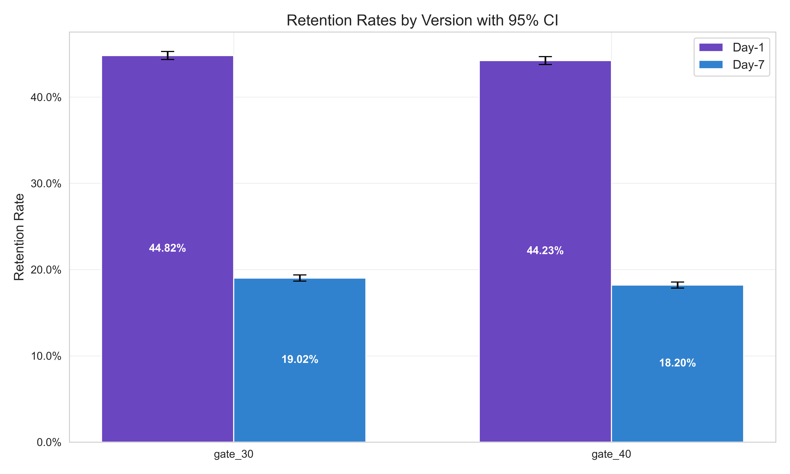

# Cookie Cats A/B Test Analysis

Impact of moving a mobile game progression gate on retention & engagement


## Executive Summary

**Business question:** Does moving the gate from level 30 → 40 affect player retention and engagement?

**Primary metric:** Day‑7 retention (``retention_7``).

**Result:** Moving gate to level 40 **reduces day-7 retention by ~0.8 pp** (p < 0.05), which is below the pre‑specified 1.0 pp MDE.

**Decision:** _Do not roll out._ While the result is statistically significant, the effect is below the practical threshold.

## Dataset

| column | data type | description | 
|--------|-----------|-------------|
| `userid` | `int` | Unique player ID |
| `version` | `str` | Experiment split (``gate_30`` = control, ``gate_40`` = treatment) |
| `sum_gamerounds` | `int` | Total rounds per player |
| `retention_1` | `bool` | Active 1 day after installing the game |
| `retention_7` | `bool` | Active 7 days after installing the game |

Contains approximately 90k players (each row corresponding to 1 player), balanced across experiment groups.

[Link to data source](https://www.kaggle.com/datasets/mursideyarkin/mobile-games-ab-testing-cookie-cats)

## Experiment Design

**Population:** ``gate_30`` and ``gate_40`` players, with a balanced split of approximately 45k records

**Primary metric:**
- Day-7 retention (``retention_7``): Two‑proportion z‑test

**Guardrail metrics:**
- Day-1 retention (``retention_1``): Two-proportion z‑test
- Engagement (``sum_gamerounds``): Mann–Whitney U test and Welch's t-test on log-transformed data

**Power / MDE:** 80% power target, 1.0 pp MDE

**Significance level:** pre-specified as 5% (alpha = 0.05) with 95% CI

**Multiple testing correction:** guardrails adjusted via Holm method

**Decision rule:** Rollout only if the result is statistically significant, the experiment effect is larger than 1.0 pp, and guardrails do not display any negative effect.

## Key Results

| Metric          | Test             | Control | Treatment | Abs Δ (pp/unit)   | p-value |
| --------------- | ---------------- | ------- | --------- | ----------------- | ------- |
| Day-7 retention | Two-proportion z | 19.02%  | 18.20%    | -0.82 pp (-4.31%) | 0.0016  |
| Day-1 retention | Two-proportion z | 44.81%  | 44.22%    | -0.59 pp          | 0.15    |
| Game rounds     | Mann–Whitney U   | 52.46   | 51.30     | -1.16             | 0.15    |
|                 | Welch's t (log)  | 2.888   | 2.870     | -                 | 0.15    |

Day-7 retention effect size (Cohen’s h) = 0.02 (negligible)  
Day-7 retention absolute drop is -0.82 pp with 95% CI [-1.33, -0.31] pp.

**Note:** guardrail p-values are Holm-adjusted.




## Business Impact

Per 100k installs, the test result indicates **820 fewer players** retained by day 7, with the true impact likely between 312 and 1328 fewer players (95% confidence). Assuming an ARPU of $0.50 a month, that means **~$410  monthly revenue loss** per 100k installs.

## Limitations & Next Steps

The dataset does not indicate whether players actually reached the gate level. Some players may not have been exposed, which can dilute test results. Future experiments should condition on gate exposure.

## Repository Structure

- ``notebook/cookie_cats.ipynb``: main notebook containing EDA, sanity checks, tests, visualization
- ``reports/results_table.csv``: experiment results table as CSV
- ``reports/report.pdf``: experiment report as PDF
- ``reports/figures/``: plots folder (png images)

## How to Run

````
pip install -r requirements.txt
jupyter notebook cookie_cats.ipynb
````
